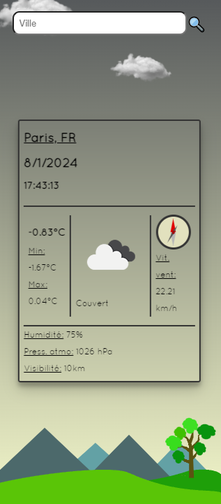
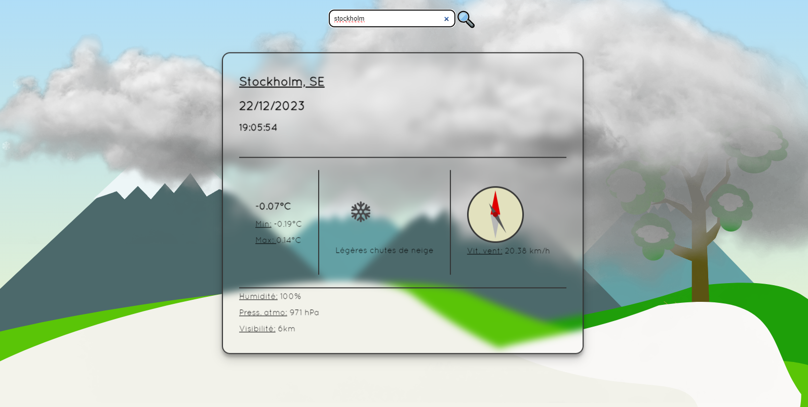
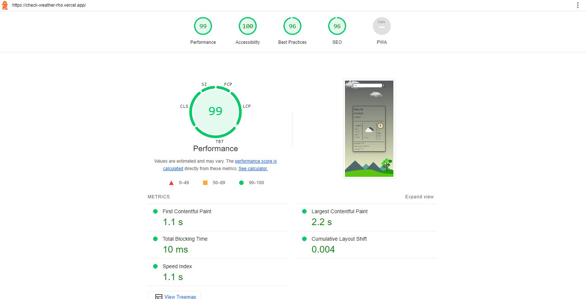

## Weather App

## Fr

### Description

App météo.

Voir la météo du jour dans le monde entier.

### Détails

Celui-ci c'est une app météo, il trainait dans mes dossier depuis longtemps, et comme j'aime que les choses présentent au moins un résultats correct j'ai décidé de le finir. Et c'était aussi un moment pour ne pas perdre la main en React.js.
J'ai utilisé l'api d'[openweathermap](https://openweathermap.org/) pour les données.

Ce que j'ai le plus apprécié dans ce projet c'est l'affichage dynamique en fonction du temps et l'animation de la pluie et de la neige. Pour cette dernière je ne suis pas sûre que ce soit la meilleur manière de les faires, je pense que les canvas seront plus adapté.
Le paysage est un svg et a été fait par moi avec figma. Les nuages et la brume sont libre de droit.

Je te laisse le découvrir [ici](https://check-weather-rho.vercel.app/)

## En

This app is my personal weather application, which I developed primarily to practice React.js. It had been sitting in my folder for quite some time, so I finally decided to complete it.

The API used for fetching weather data is [openweathermap](https://openweathermap.org/). One of the aspects I enjoyed the most was creating a dynamic display for weather conditions, including a raining and snowing effect. However, I'm not entirely certain if this is the optimal way to implement it. I am considering using canvas for a more effective solution.

Improvement clue : - Use chart.js for min/max temperature

To view the site, click [here](https://check-weather-rho.vercel.app/)

### Technologies: React.js

### Images:

